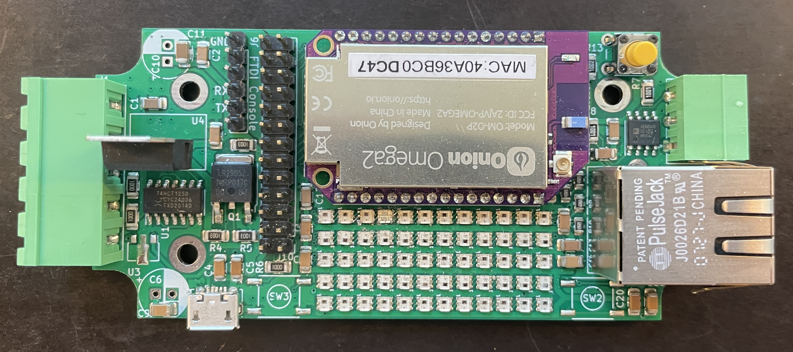

# P44-mini-lx PCB for WS28xx SmartLEDs + DMX

This is a simple KiCAD PCB design to use a Onion Omega2(+) module as a LED + DMX controller with the [P44-xx-open](https://github.com/plan44/p44-xx-open) opensource firmware.

## Features

- configurable for 5V powered WS2813,WS2816,SK6812 and similar as well as 12V powered WS2815.
- optional power PWM or on/off output for separate non-smart LED or powering off LED chains when idle.
- RS485 interface (not opto isolated) which can be used as DMX512 output (or to drive Swiss Railways splitflap modules, or for modbus RTU)
- Ethernet RJ45 Jack on board
- room for small 5*12 WS2816 LED array (as a test/demo, hard to solder, harder to fix soldering errors)
- two buttons
- PSU (5V or 12..24V) to 3.3V regulator (either cheap LDO for 5V PSU, or Recom switching regulator in TO220 compatible housing for PSU voltage >5V)

## Resources

- [Schematics PDF](docs/p44-mini-lx.sch.pdf)
- [Assembly views PDF](docs/p44-mini-lx.pcb.pdf)
- [iBOM - interactive bill of materials html](bom/p44mini_lx%20-%20%202024-11-26%20-%20ibom.html)
